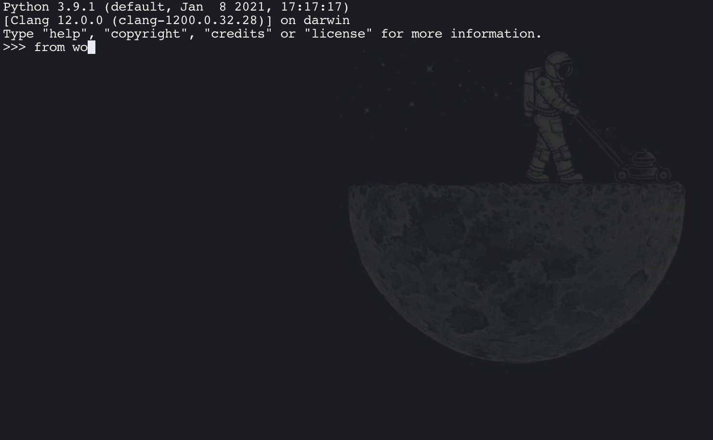

# Wordle Stats
## Author: Tom Henry

## Description
Wordle Stats is a score generator that takes challenging your friends in Wordle to the next level. It provides scores for how good each guess was as well as score boosts for how many rounds it took you to solve the puzzle!

## Installation
```bash
pip install wordlepoints
```

And then to run, simply input:
```bash
python -m wordlepoints.wordle_stats
```
## Usage
The following gif is an example of the usage in a python shell:



Enter the correct word of the day, followed by your guesses (including the correct guess) to get your final score! A perfect score is 600 points, meaning that you guessed the word of the day correctly on the first round.

## How it works
This program takes every possible five letter word in the english language (provided by nltk) and scores each guess based on how much your guess shortened the list of possible correct answers.

For example, a guess that resulted in a green letter would then reduce the list of possible answers to only containing words with that letter in that index, and a guess that resulted in yellow letters would shorten the list to only contain words with that letter in that word. The greater the percentage drop of words, the more points you score. If you finish before the six rounds, you are awarded 100 points for each unused round.

Have Fun!
